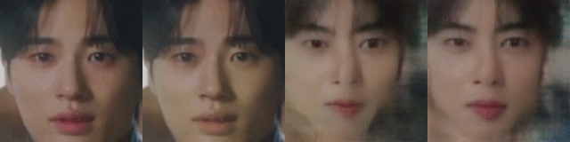
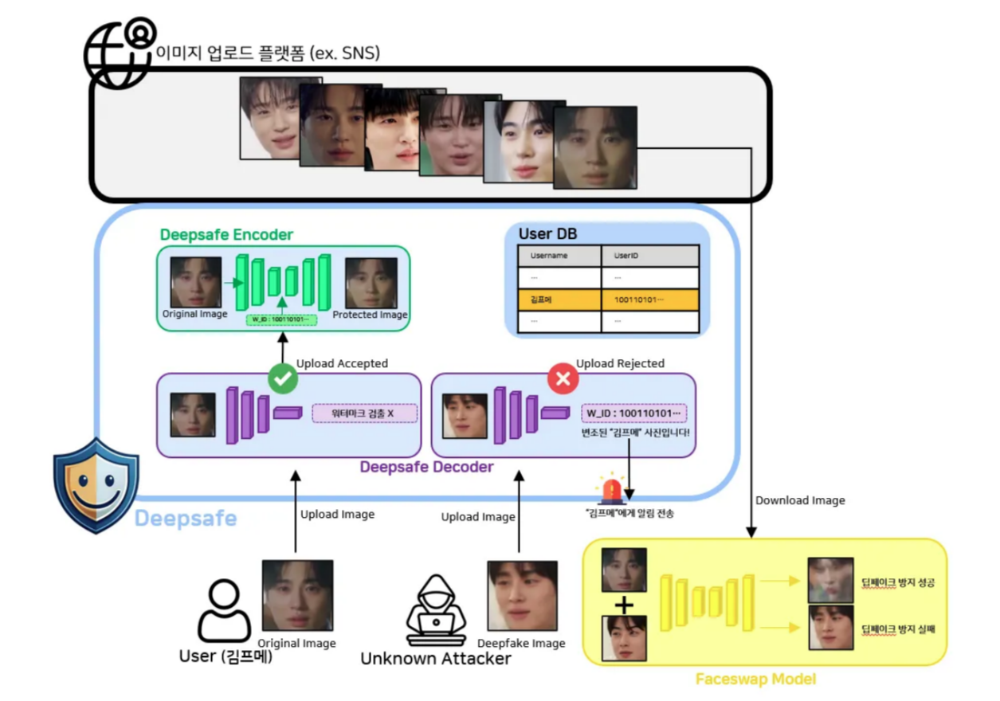
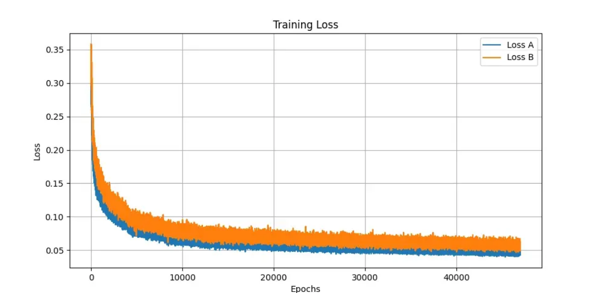
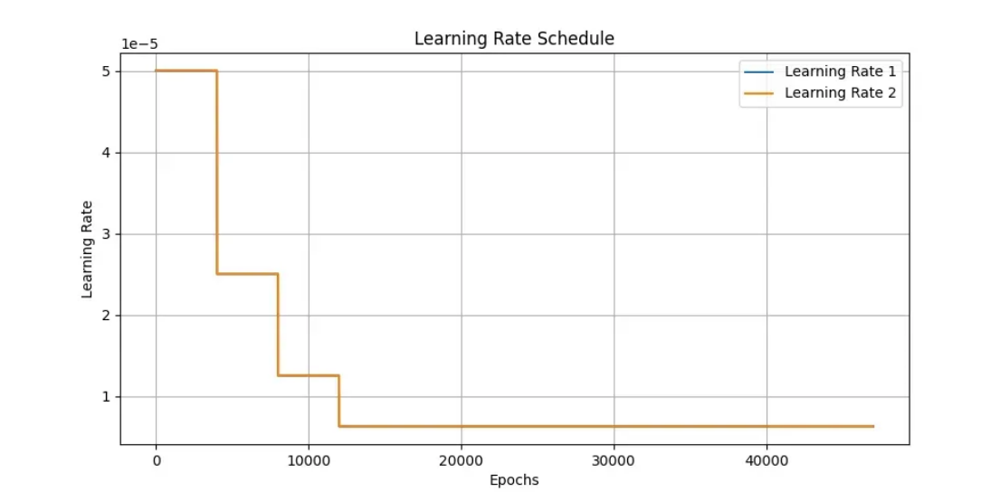
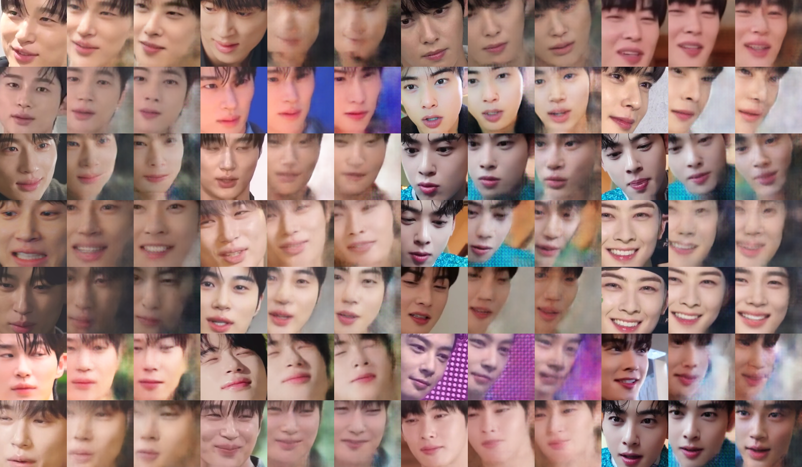
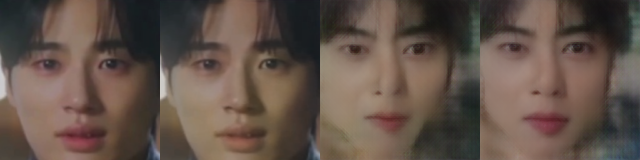
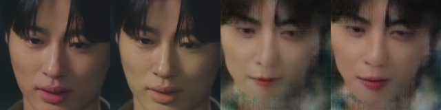
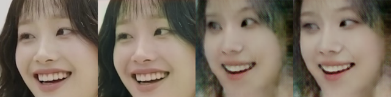
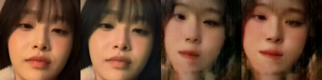
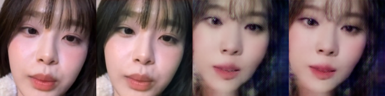

# deepsafe
## Introduction
The misuse of deepfake technology poses serious security threats, such as identity theft. DeepSafe is a defense system that employs an Adversarial Robust Watermarking technique to disrupt face-swapping models while enabling image source tracking. Based on the [Dual Defense framework](https://ieeexplore.ieee.org/document/10486948), this system utilizes the Original-domain Feature Emulation Attack (OFEA) method to embed an invisible watermark, preventing face swapping while ensuring identity traceability.  

<div style="text-align: center;">
  
  <p>Original Image / Encoded / Protected 🔒/ Attacked 🔓</p>
</div>

*DeepSafe offers a two-layered defense mechanism against deepfake attacks:*
### 1️⃣ Preemptive Deepfake Prevention ✅
- When users upload their images, DeepSafe embeds an invisible adversarial watermark that disrupts face-swapping models.
- The watermarked image is uploaded to the platform, ensuring protection.
- If an attacker attempts face-swapping, the image degrades or fails to swap properly due to the embedded watermark.

### 2️⃣ Post-attack Detection & Identity Tracking ⚠️
- Even if the face-swapping model processes the image, DeepSafe preserves watermark information.
- The watermark can be extracted from manipulated images, allowing for identity tracking and alerting affected users


#### Our Pipeline looks following:
<p align="center">
  
</p>

## ⚒️ How to Play
```
npm install
npm run dev
```

## 📂 Dataset & Preprocessing 
- 4 identities: Winter, Chuu, Cha Eun-woo, and Byeon Woo-seok (800 images per person, total: 4,000 images)- Extracted frames from YouTube videos (Winter: 35, Chuu: 48, Cha Eun-woo: 31, Byeon Woo-seok: 48 videos)
- Preprocessing:
    - Extracted frames every 20 frames using OpenCV
    - Face cropping: resized to 256x256
    - Final resizing: 160x160 for model training

## 💫 Model Training & Results 
### 1) Faceswap
- Training Epochs: 47,000
- Loss Functions:
    - L1 Loss (weight = 1.0)
    - VGG Perceptual Loss (weight = 0.08)
- Optimizer: Adam (lr=5e-5) with MultiStepLR scheduler
- Baseline Code: [Faceswap Deepfake Pytorch](https://github.com/Oldpan/Faceswap-Deepfake-Pytorch)


<p align="center">
  
  
</p>

<p align="center">
  
</p>

### 2) Dual Defense 
- loss
    - alpha * `image_loss` + beta * `message_loss`
        - `image_loss` = lambda_en * image_encoded_loss + lambda_s * ssim_loss + lambda_adv * image_adv_logits_loss
        - `message_loss` = L_wm_en + L_wm_adv
- lambda(beta)=1, alpha=2
- Train:Valid:Test=0.8:0.1:0.1
- message size = 4 (16bits, watermark information)
- batch size = 16


<p align="center">
  <table>
    <tr>
      <th><h2> Original Image →  Encoded ✅ →  Protected 😀🔒 → Attacked 🥵🔓</h2></th>
    </tr>
    <tr>
      <td></td>
    </tr>
    <tr>
      <td></td>
    </tr>
    <tr>
      <td></td>
    </tr>
    <tr>
      <td></td>
    </tr>
    <tr>
      <td></td>
    </tr>
  </table>
</p>


## References 
- Dual Defense official codes: https://github.com/Xming-zzz/DualDefense?tab=readme-ov-file


