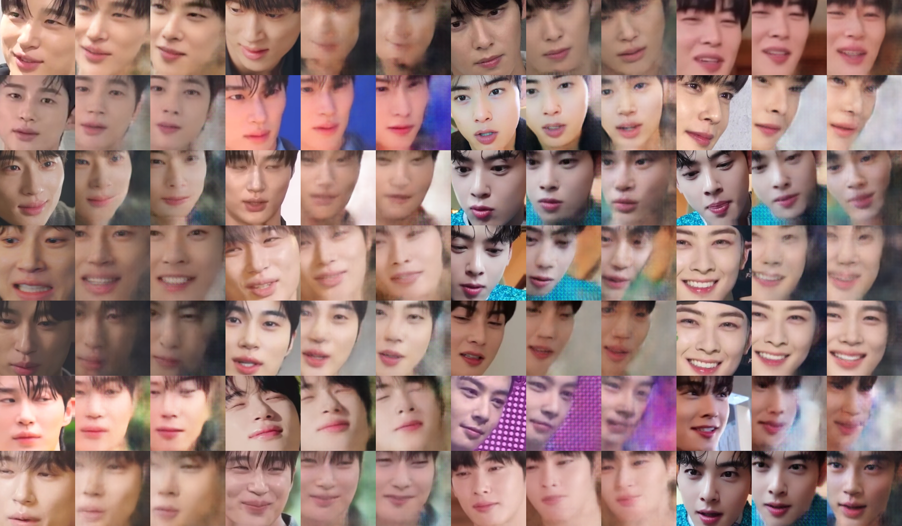
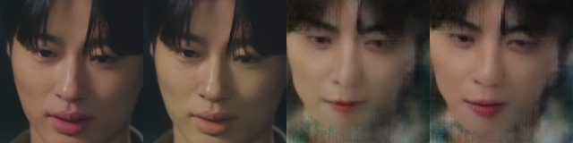

# deepsafe
The Dual Shield for Deepfake Security  

## Introduction
The misuse of deepfake technology poses serious security threats, such as identity theft. DeepSafe is a defense system that employs an Adversarial Robust Watermarking technique to disrupt face-swapping models while enabling image source tracking. Based on the [Dual Defense framework](https://ieeexplore.ieee.org/document/10486948), this system utilizes the Original-domain Feature Emulation Attack (OFEA) method to embed an invisible watermark, preventing face swapping while ensuring identity traceability.

## How to Play
```
```
## Results
#### 1) Faceswap 


#### 2) Dual Defense 
Original Image | Encoded Image | Swapped on Defensed Image | Swapped on original image



## References 
- Dual Defense official codes: https://github.com/Xming-zzz/DualDefense?tab=readme-ov-file